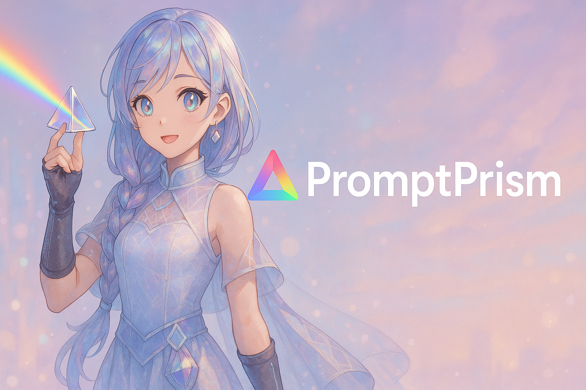
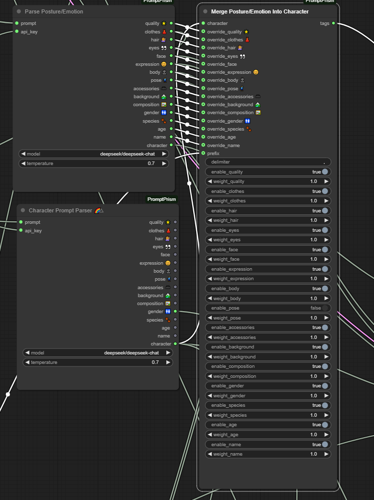

# 🌈⃤ PromptPrism


PromptPrism is a ComfyUI custom node that helps you parse character descriptions for image generation and organize them into structured categories.

This is helpful to fine-tune character-focused image generations, for Visual Novels, Character sprites, etc...

## 📸 Usage

> **Note**: You'll need API keys for the AI providers you wish to use

> _Character Prompt Merger customizing tag categories_

Connect your prompt to the parser node, it will split it into categories, then you can use the merger node to select which categories you want to include in your final prompt.
You can use the parser on another prompt, and take only some elements from it, and merge them with the first one.


## 🔧 Installation

### Method 1: Install via ComfyUI Manager

### Method 2: Manual Installation

1. Navigate to your ComfyUI custom_nodes directory
2. Open a terminal in that directory, and run the following commands:

```bash
git clone https://github.com/Bewinxed/PromptPrism.git
cd PromptPrism
pip install -r requirements.txt
```

## 🚀 Usage

### Character Prompt Parser Node

This node takes a standard image generation prompt and parses it into structured categories:

1. Add the "Character Prompt Parser" node to your workflow
2. Connect a text prompt to the input
3. Select an AI provider and model
4. Provide your API key for the selected provider
5. Adjust temperature if needed
6. Run the workflow to see your prompt parsed into categories

Each category output can be used separately or combined with the Character Prompt Merger.

### Character Prompt Merger Node

This node allows you to selectively combine parsed character attributes:

1. Connect a Character object from the Parser node
2. Enable/disable specific attribute categories
3. Set custom weights for each category
4. Provide optional overrides for any category
5. Set your preferred delimiter (comma by default)
6. Run to generate a combined prompt with your preferences

## 🧩 Node Outputs

The Character Prompt Parser node provides these outputs:

- **quality 🌟**: Quality and resolution related tags
- **clothes 👗**: Clothing items
- **hair 💇**: Hair attributes
- **eyes 👀**: Eye characteristics
- **face**: Facial features
- **expression 😊**: Facial expressions and emotions
- **body 👤**: Body features and attributes
- **pose 🕺**: Character posture and position
- **accessories 🕶️**: Items worn or carried by the character
- **background 🏞️**: Setting and scene information
- **composition 🖼️**: Composition and framing details
- **gender 🚻**: Gender information
- **species 🐾**: Species information
- **age**: Age-related tags
- **name**: Character name details
- **character**: The full Character object (can be connected to the Merger node)

## 📜 License

Don't copy my stuff and claim as your own, otherwise, go crazy~

## 📞 Support

If you encounter any issues or have questions, please open an issue on the GitHub repository.
